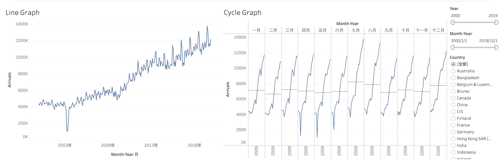
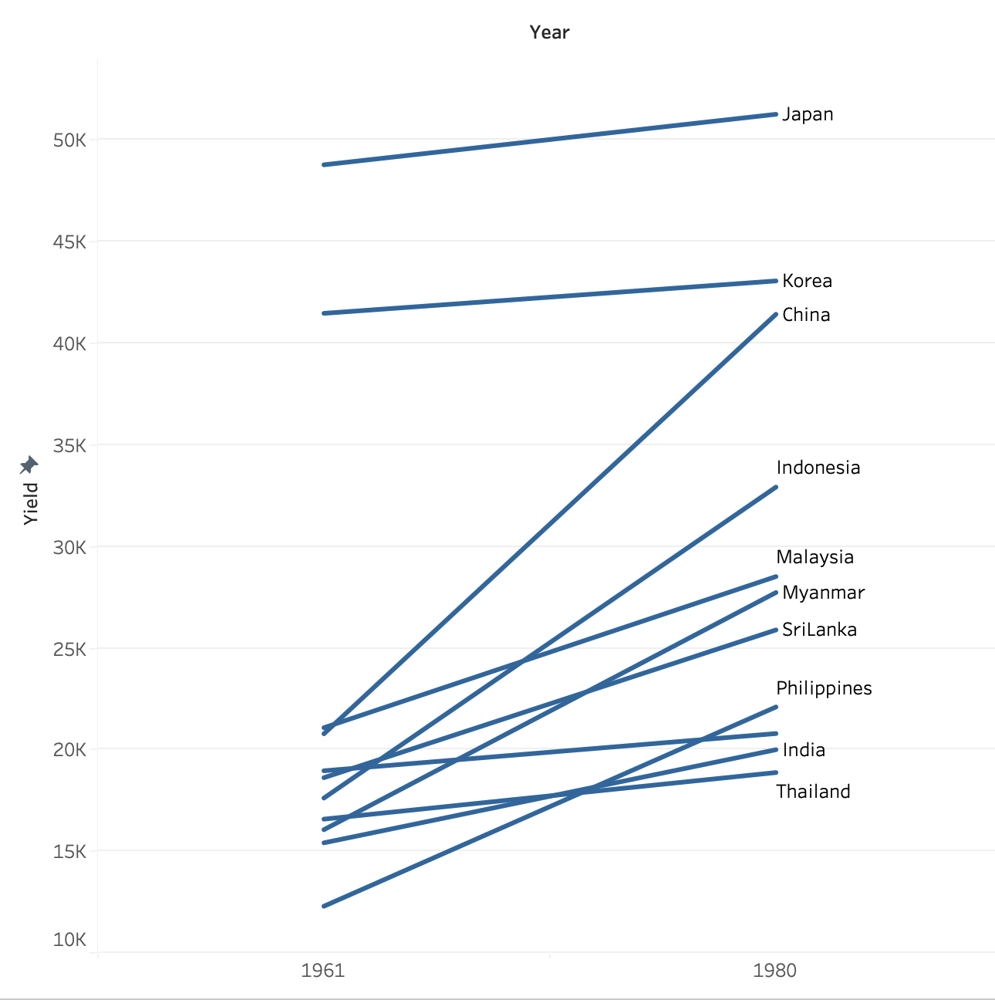
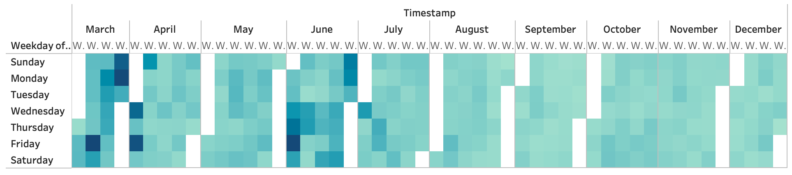
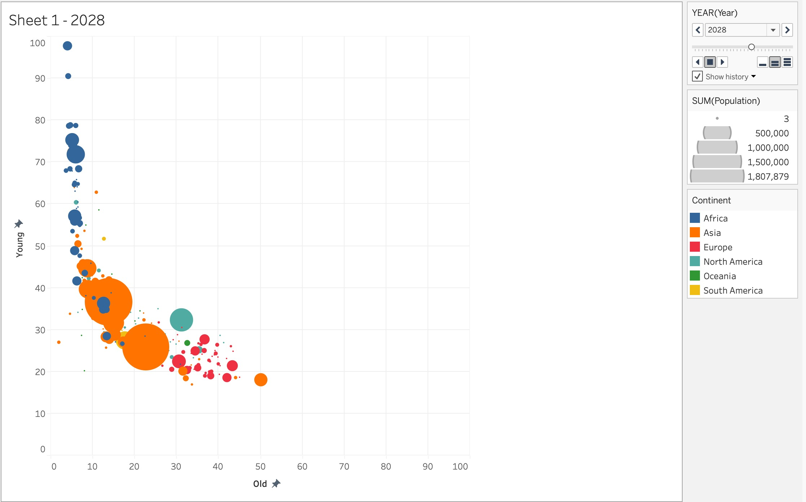

# 1. Line Graph and Cycle Graph

The first visualization displays the monthly tourist arrivals across years; the second visualization displays the cycle graph which can show the peak seasons in a year.

[Tableau Public Link](https://public.tableau.com/app/profile/minghao.liang/viz/inclass-6-CycleGraph/Dashboard1)

{fig-align="center" width="90%"}

## 1.1. Steps for cycle graph

-   Columns: MONTH(Month-Year) \| YEAR (Month-Year)
-   Rows: SUM(Arrivals)
-   Filters: Month-Year (*range of dates*) \| Country *(radio button)* \| Year (*change to numerical*)
-   Average line: y-xis -\> Add reference lines

# 2. Slope Graph

The visualization shows the change in rice yield of multiple country from Year 1961 to Year 1980.

[Tableau Public Link](https://public.tableau.com/app/profile/minghao.liang/viz/inclass-6-slopeGraph/Sheet1)

{fig-align="center" width="57%"}

## 1.1. Steps for slope graph

-   Columns: Year
-   Rows: Sum(Yield)
-   Label and Detail: Country
-   Filter: Year (*convert to discrete; select only 1961 and 1980*)

# 3. Calendar Heatmap

The calendar heatmap shows the frequency of network intrusion across different weeks and days of week.

[Tableau Public Link](https://public.tableau.com/app/profile/minghao.liang/viz/inclass-6-calendarHeatmap/Sheet1)

{fig-align="center" width="89%"}

# 3.1 Steps for calendar heatmap

-   Columns: MONTH(Timestamp) \| WEEK (Timestamp)
-   Rows: WEEKDAY(Timestamp)
-   Color: CNT (eventlog.csv)

# 4. Bubble Plot to show trend over time

The bubble plot shows the young and old population ratio forecasting of different countries.

[Tableau Public Link](https://public.tableau.com/app/profile/minghao.liang/viz/inclass-6-bubblePlotOverTime/Sheet1)

{fig-align="center" width="69%"}

## 4.1 Steps for bubble plot with animation

-   Columns: SUM(Old)

-   Rows: SUM(Young)

-   Color: Continent

-   Size: SUM(Population)

-   Detail, Label: Country

-   **Pages: YEAR(Year)**
