# 1. Overview

In this exercise, the demographic structure of Singapore at planning area level will be revealed using age-sex pyramid method; data of nine selected planning areas will be presented on a single view by using trellis display.

The data used in this exercise is from [SingStat](https://www.singstat.gov.sg/-/media/files/find_data/population/statistical_tables/respopagesexfa2022.ashx), and read into Tableau Desktop 2022.4 for data visualization.

The data contains 7 columns:

```{r warning=FALSE, message=FALSE, echo=FALSE}
library(knitr)
columns <- c('PA', 'SZ', 'AG', 'Sex', 'FA', 'Pop', 'Time')
interpretation <- c('Planning Zone', 'Subzone', 'Age Group', 'Sex', 'Floor Area of Residence', 'Population', 'Time period')
df <- data.frame(columns, interpretation)
kable(df, caption = "Data Dictionary")
```

# 2. Choosing The 9 Planning Areas

The following nine planning area are chosen: **Tempines, Seng Kang, Ang Mo Kio, Woodlands, Chua Chu Kang, Jurong West, Toa Payoh, Queenstown, Bukit Timah.**

Justification/Reasons to choose these area: these planning areas are top 2 or 3 in population within their own regions, which means the population size is sufficient for us to visualize the demographic structure, compared to those areas with a smaller population.

# 3. Visualization on Tableau

The outcome of visualization can be viewed on [Minghao's Tableau Public](https://public.tableau.com/app/profile/minghao.liang/viz/take-home-1_16741369553030/AgePyramid?publish=yes).

<center>
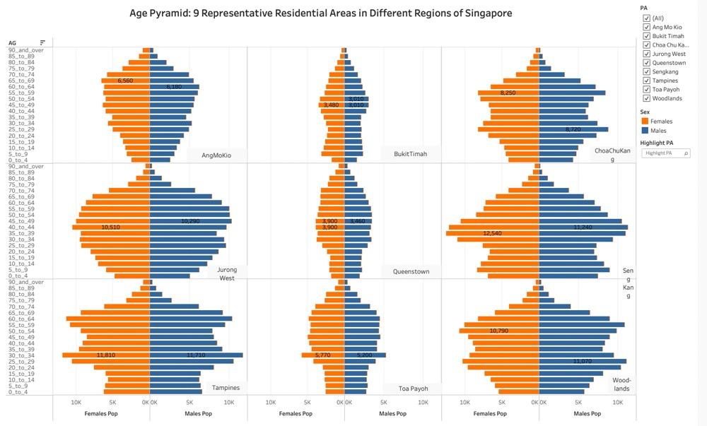 
</center>

# 4. Insights and Observations

# 5. Step-by-Step Procedures

### 5.1 Data Preparation

| No. | Steps                                                                               | Action                      |
|:--------------|:---------------|:----------------------------------------|
| 1   | Load the required data "residents_by_area.csv"                                      | 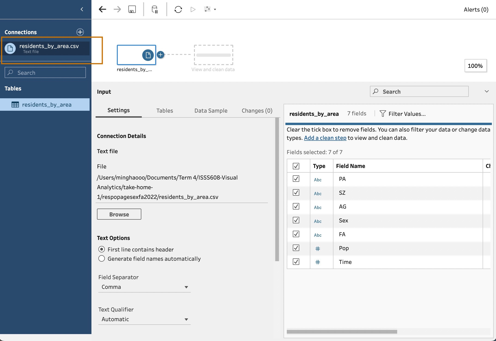 |
| 2   | Press the "+" button, select "Add clean step"                                       |  |
| 3   | Select "Filter - Selected values"                                                   | 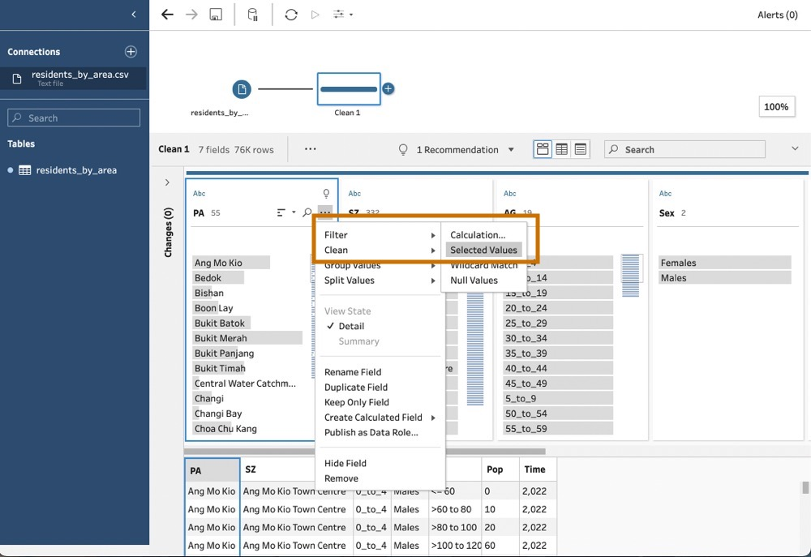 |
| 4   | Select the 9 destinated planning areas                                              | 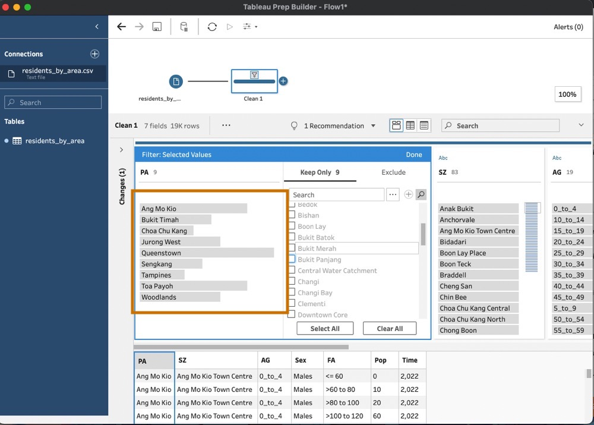 |
| 5   | Remove Column *Time*, as all rows are from year 2022, hence the column is redundant | 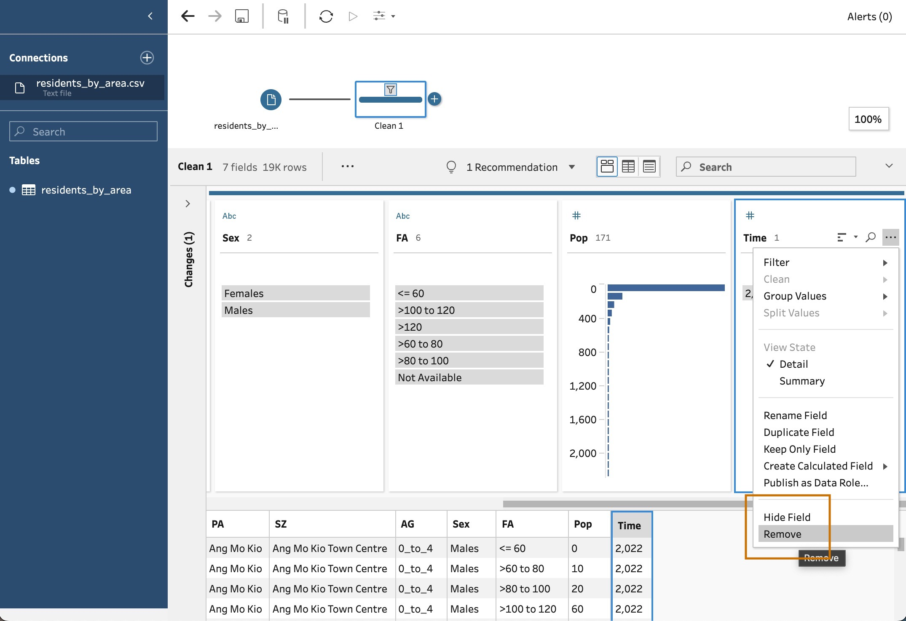 |
| 6   | Output the prepared data as .csv file                                               | 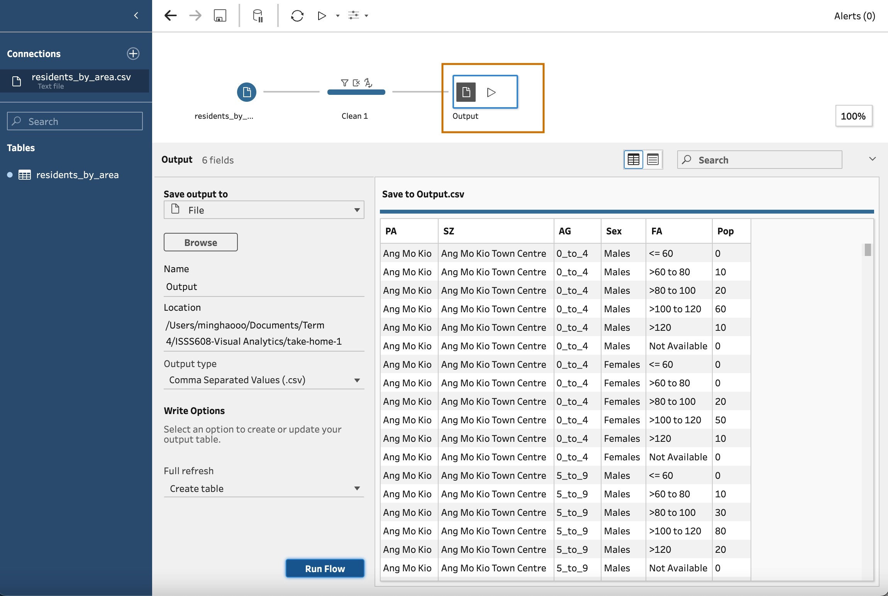 |

### 5.2 Data Visualization

| No. | Steps                                                                               | Action                      |
|:--------------|:---------------|:----------------------------------------|
| 1   | Load the required data "residents_by_area.csv"                                      |  |
| 2   | Press the "+" button, select "Add clean step"                                       | 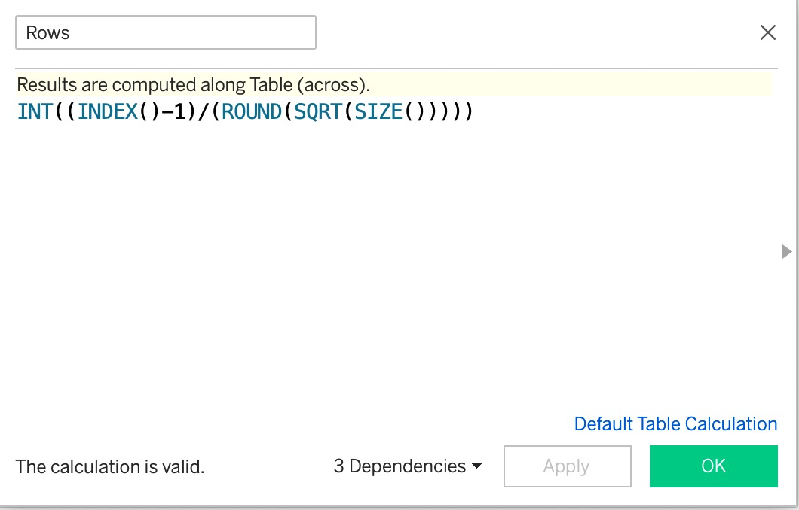 |
| 3   | Select "Filter - Selected values"                                                   | 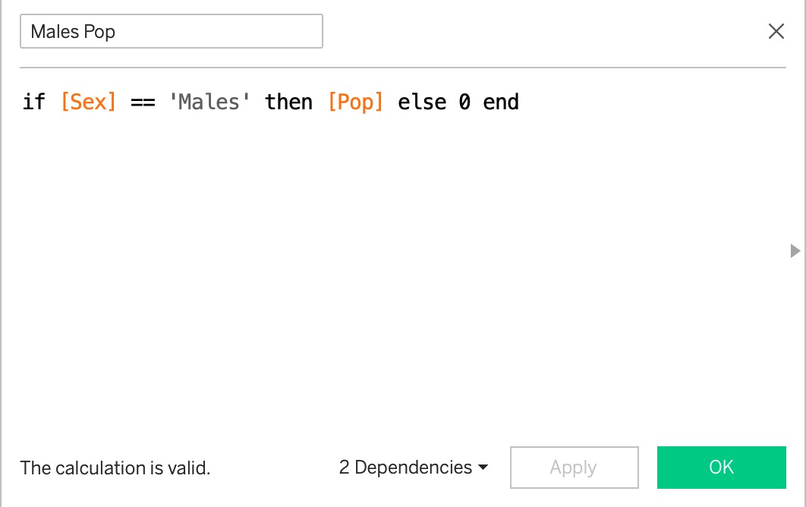 |
| 4   | Select the 9 destinated planning areas                                              | 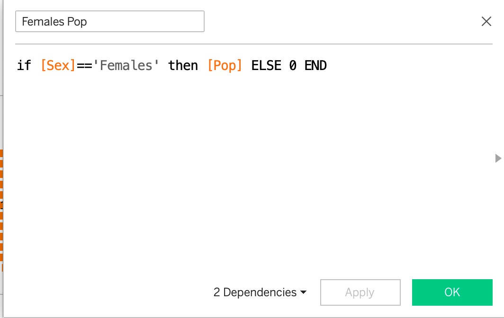 |
| 5   | Remove Column *Time*, as all rows are from year 2022, hence the column is redundant | 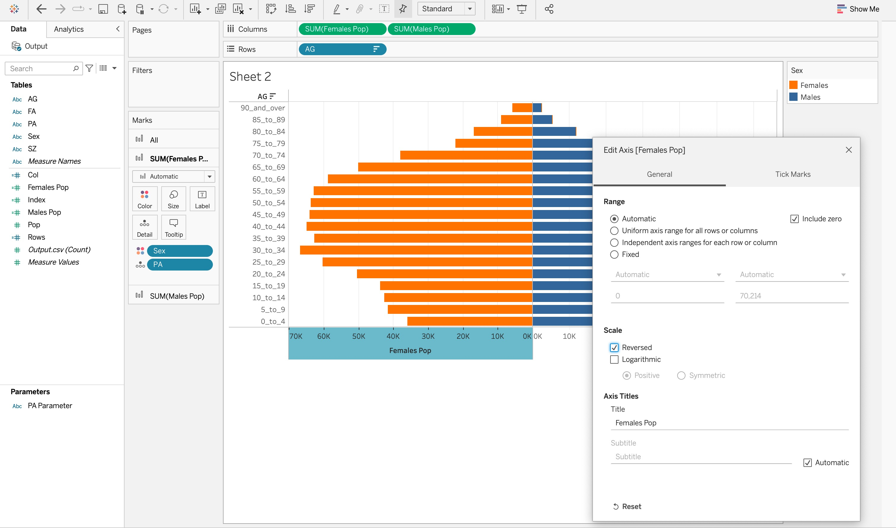 |
| 6   | Output the prepared data as .csv file                                               | 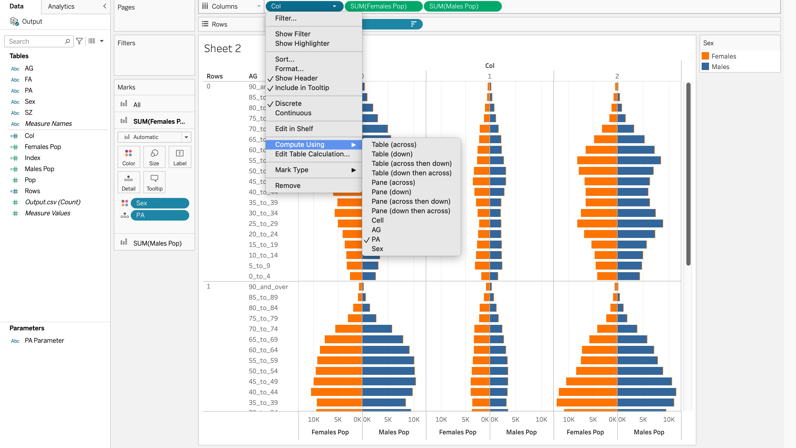 |
| 7   | Output the prepared data as .csv file                                               | 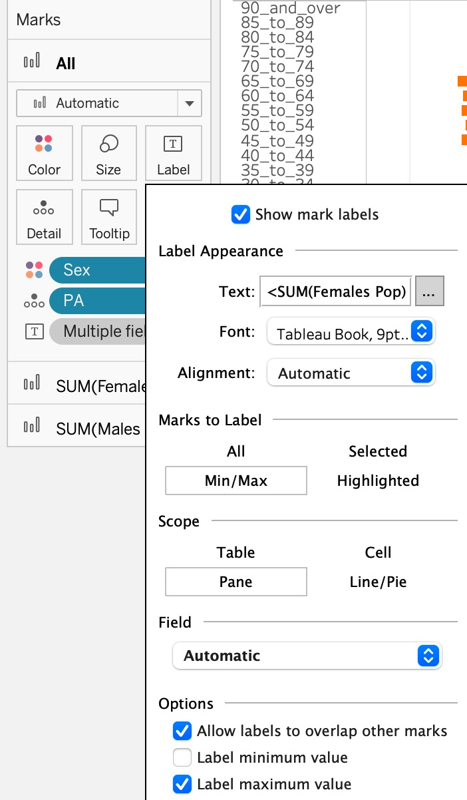 |
| 8   | Output the prepared data as .csv file                                               | 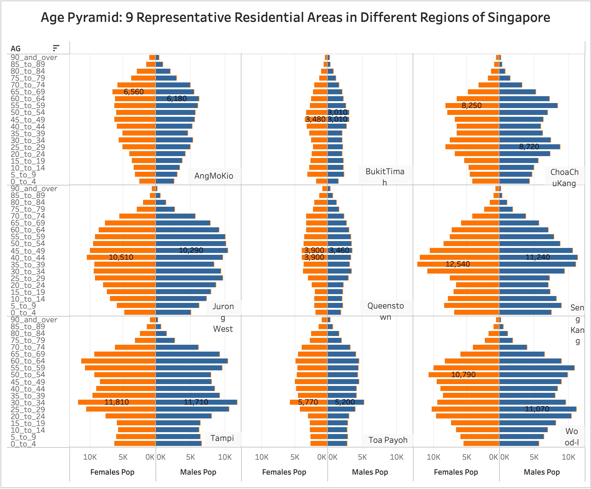 |
