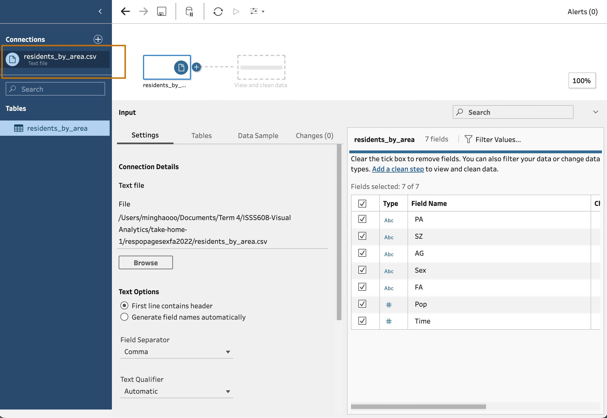
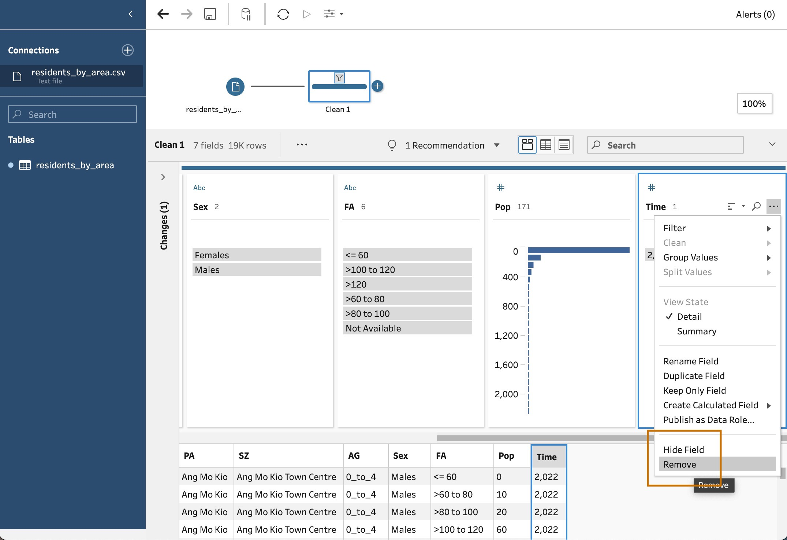
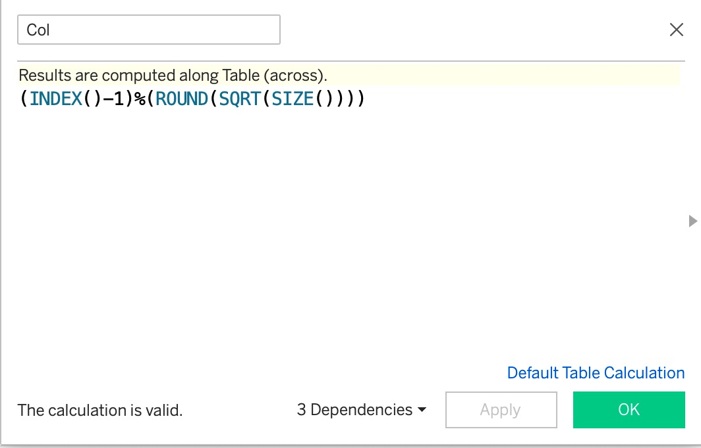
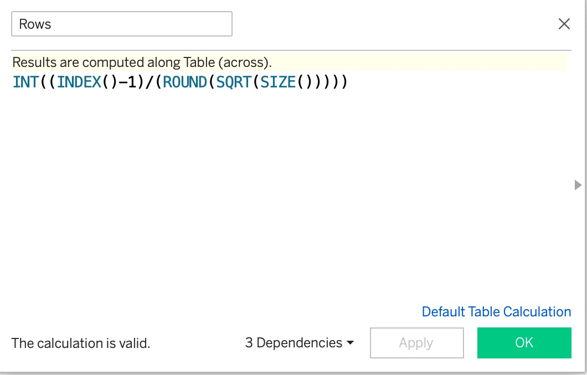
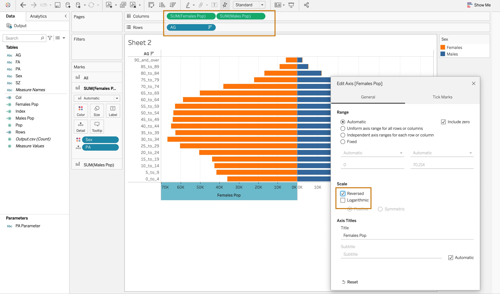
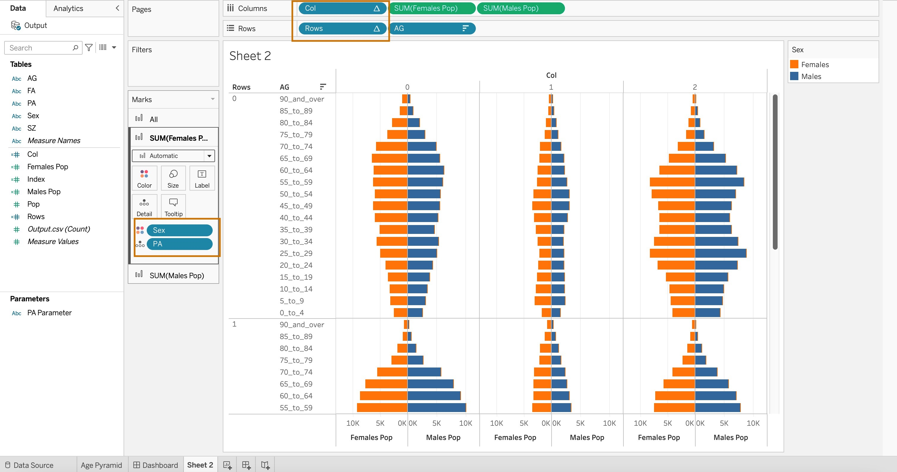
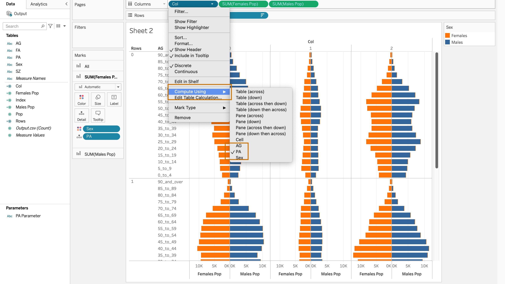
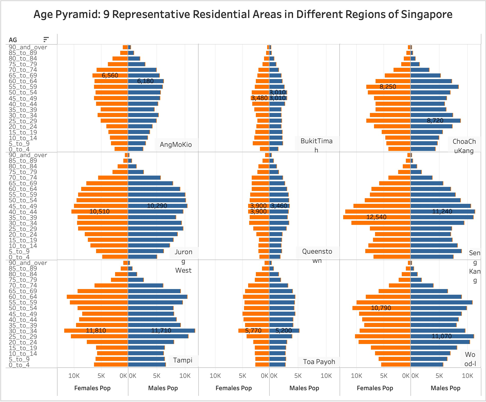

# 1. Overview

In this exercise, the demographic structure of Singapore at planning area level will be revealed using age-sex pyramid method; data of nine selected planning areas will be presented on a single view by using trellis display.

The data used in this exercise is from [SingStat](https://www.singstat.gov.sg/-/media/files/find_data/population/statistical_tables/respopagesexfa2022.ashx), and read into Tableau Desktop 2022.4 for data visualization.

The data contains 7 columns:

```{r warning=FALSE, message=FALSE, echo=FALSE}
library(knitr)
columns <- c('PA', 'SZ', 'AG', 'Sex', 'FA', 'Pop', 'Time')
interpretation <- c('Planning Zone', 'Subzone', 'Age Group', 'Sex', 'Floor Area of Residence', 'Population', 'Time period')
df <- data.frame(columns, interpretation)
kable(df, caption = "Data Dictionary")
```

# 2. Choosing The 9 Planning Areas

The following nine planning area are chosen: **Tempines, Seng Kang, Ang Mo Kio, Woodlands, Chua Chu Kang, Jurong West, Toa Payoh, Queenstown, Bukit Timah.**

Justification/Reasons to choose these areas: these planning areas are top 2 or 3 in population within their own regions, which means the population size is sufficient for us to visualize the demographic structure, compared to those areas with a smaller population.

# 3. Visualization on Tableau

The outcome of visualization can be viewed on [Minghao's Tableau Public](https://public.tableau.com/app/profile/minghao.liang/viz/take-home-1_16741369553030/AgePyramid?publish=yes).

<center></center>

# 4. Insights and Observations

(1) As a general trend, the visualization indicates that age pyramids of 9 planning areas in Singapore tend to be constrictive, meaning that the bottom part (i.e., children and youths) is narrow and has a smaller population, whereas the middle-top (i.e., mid-age/elderly) part is huge in population. This shows Singapore has entered into an aging society.

(2) Sengkang, as one of the more newly established estate areas, have the youngest demographic structure among all selected areas, as it is shown that the age pyramid peaks at 35-39 (for female) and 40-44 (for male); the bottom part of age pyramid of Sengkang is also the widest among all, representing a more significant number of young people in the area.

(3) For earlier established areas such as Ang Mo Kio, Choa Chu Kang, Tampines and Woodlands, the age pyramids tilt towards the top to a large extent, indicating a more aging community within the areas.

(4) Government should pay more attention to these areas and implement more elderly-oriented facilities, such that the needs of aged people can be taken care of.

# 5. Step-by-Step Procedures

### 5.1 Data Preparation

| No. | Steps                                                                               | Action                      |
|:----------------|:----------------|:--------------------------------------|
| 1   | Load the required data "residents_by_area.csv"                                      |  |
| 2   | Press the "+" button, select "Add clean step"                                       |  |
| 3   | Select "Filter - Selected values"                                                   |  |
| 4   | Select the 9 destinated planning areas                                              |  |
| 5   | Remove Column *Time*, as all rows are from year 2022, hence the column is redundant |  |
| 6   | Output the prepared data as .csv file                                               |  |

### 5.2 Data Visualization

| No. | Steps                                                                                                                                                        | Action                         |
|:----------------|:----------------|:--------------------------------------|
| 1   | Create new calculation field "Col" using the following formula (To assign column index)                                                                      |     |
| 2   | Create new calculation field "Rows" using the following formula (To assign row index)                                                                        |     |
| 3   | Create new variable "Males Pop" so that only male population is displayed                                                                                    |     |
| 4   | Create new variable "Females Pop" so that only female population is displayed                                                                                |    |
| 5   | Drag "Females Pop" and "Males Pop" onto Column Page, and drag "AG" to Rows Page. Right click horizontal axis, select "edit axis" and check "Reversed" field. |    |
| 6   | Drag "Col" onto Column Page and drag "Rows" to Rows Page; Drag "PA" to Detail Mark                                                                           |  |
| 7   | For "Col" and "Rows" fields, select Compute Using - PA                                                                                                       |    |
| 8   | Under Marks - All, select min/max Label for SUM(Females Pop) and SUM(Males Pop); uncheck "Label minimum value" to display the maximum values only            |    |
| 9   | Rename the worksheet and save.                                                                                                                               |    |
