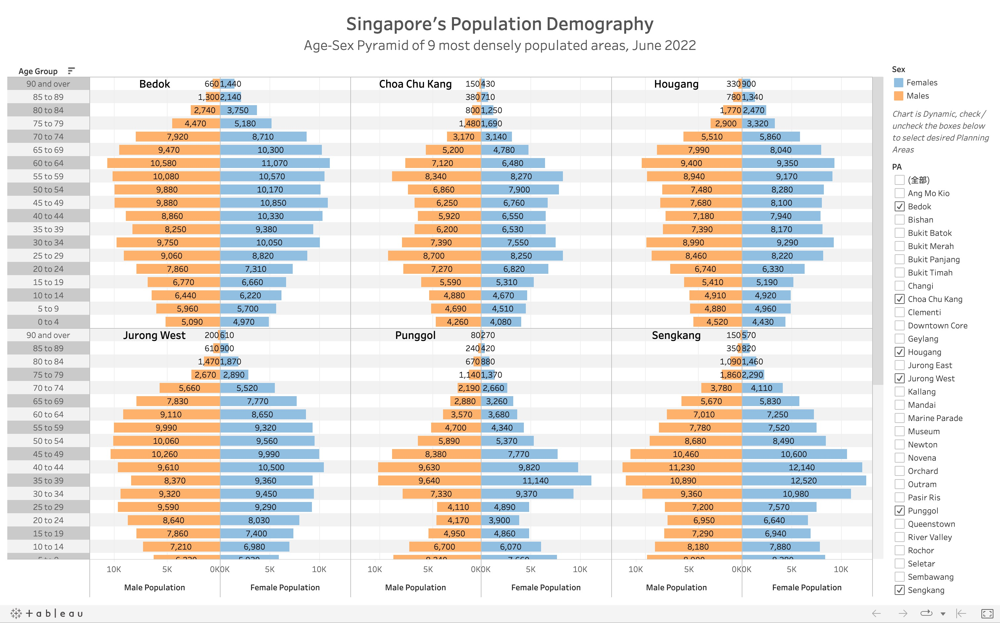
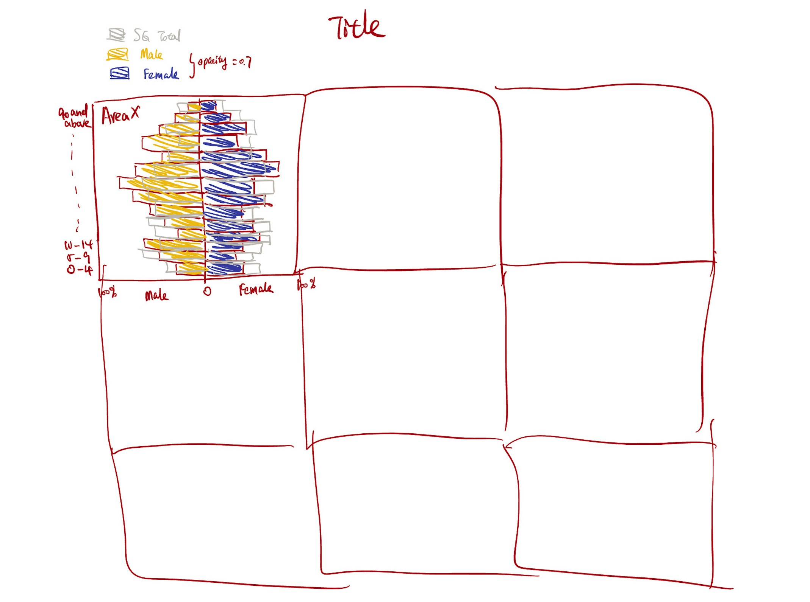

# 1. Overview

This take-home exercise is done based on a take-home exercise 1 submission prepared by a classmate. The peer submission will be critiqued in terms of **clarity** and **aesthetics**, and the original design will be remade using the data visualization principles and best practice learnt in Lesson 1 and 2.

The dataset used in take-home exercise 1 and 2 is downloaded from [SingStat](https://www.singstat.gov.sg/find-data/search-by-theme/population/geographic-distribution/latest-data), and processed by RStudio `tidyverse` family of packages and visualized by `ggplot2` and its extensions.

# 2. Getting Started

## 2.1. Import necessary packages

Before we get started, it is important for us to ensure that the required R packages have been installed.

R package `pacman` is used to load all required packages, and install them automatically if the packages are not installed. The code chunk below is used to install and load the required packages onto RStudio.

```{r}
pacman::p_load(dplyr,tidyverse,ggplot2,patchwork)
```

## 2.2. Import data

```{r}
# read csv file
residents <- read_csv('../Data/residents_by_area.csv')
```

# 3. Critics and Makeover of Visualization using R

## 3.1. The original visualization

The original visualization prepared by our classmate shows a trellis plot containing age-sex pyramids of 9 different areas in SG using Tableau Desktop; in each grid, the right-hand side displays male population and the left-hand side displays female population, binned by age groups.

{fig-align="left" width="80%"}

## 3.2. Critic: Clarity

-   Contrast colours are used for male and female population, which gives clear disinction.

-   **Absolute** value of population is used in the visualization; as different areas have different population sizes, it is difficult to compare the age structure against each other.

-   Value of **every bar** is shown in the graph, which can be distracting for the audience.

-   To give a clearer comparison to the overall population, each of the grid in the trellis can be overlay-ed on the age-sex pyramid of **SG's total population**.

## 3.3. Critic: Aesthetic

-   The axes and titles are nicely labelled.

-   Instruction is stated above the checkboxs clearly, allowing users to change areas to be displayed.

## 3.4. Sketch of Propose Design

The proposed design is meant to keep the advantages of the original design, and mainly improve on clarity, so that more informative visualization can be produced.

Below is the sketch of the makeover design.

{fig-align="left" width="70%"}

## 3.5. Visualization Makeover using R

### Producing the background

Firstly, compute sum of population by sex and age groups.

```{r}
SG_pop <- sum(residents$Pop)

res_total <- residents %>%
  group_by(Sex,AG) %>%
  summarise(total_pop=sum(Pop))%>%
  #PopPerc, if female -> positive, if male -> negative
  mutate(PopPerc=case_when(Sex=='Females'~round(total_pop / SG_pop, 4), 
                                       TRUE~-round(total_pop / SG_pop, 4)), 
                                       signal=case_when(Sex=='Females'~1,TRUE~-1))
#set age group level
res_total$AG <- str_replace_all(res_total$AG,'_',' ')
res_total$AG <- factor(res_total$AG, levels = unique(str_replace_all(residents$AG,'_',' ')), ordered=TRUE)
#levels(res_total$AG)
#head(res_total)
```

Plotting of overall population. The object `total_pop_plot` will be used for background of plots of each of the areas. Notice that x-axis shows the percentage of population by age group and sex over total SG population.

```{r}
total_pop_plot <- ggplot(res_total) + 
  geom_bar(aes(x=AG,y=PopPerc), stat = 'identity', 
           fill = "grey",alpha=0.6) + 
  coord_flip()
total_pop_plot
```

### Produce per area plot

Next, aggregate population by Planning Areas, Sex and Age Group.

```{r}
res_by_area <- residents %>%
  group_by(PA, Sex, AG) %>%
  summarise(total_pop=sum(Pop))
#set age group level
res_by_area$AG <- str_replace_all(res_by_area$AG,'_',' ')
# order age group properly
res_by_area$AG <- factor(res_by_area$AG, levels = unique(str_replace_all(residents$AG,'_',' ')), ordered=TRUE)
# levels after assigning order
levels(res_by_area$AG)
#res_by_area
```

Define function that plot for one area, so that codes can be re-usable by inputing different area names as parameters.

```{r}
plot_one_area <- function(area){
  # area name as parameter
  area_data <- subset(res_by_area, PA==area)
  #compute total population
  area_population <- sum(area_data$total_pop)
  #compute population% by sex & AG over total population in the area
  #use case_when to split male and female population to different size, by using +/- numbers
  area_data <- mutate(area_data,PopPerc=case_when(Sex=='Females'~round(total_pop / area_population, 4), 
                                       TRUE~-round(total_pop / area_population, 4)), 
                                       signal=case_when(Sex=='Females'~1,TRUE~-1))
  #compute female% and male%
  malePop <- sum((subset(area_data, Sex=='Males')$total_pop))
  femalePop <- sum((subset(area_data, Sex=='Females')$total_pop))
  malePerc <- round(malePop/(malePop+femalePop)*100,1)
  femalePerc <- round(femalePop/(malePop+femalePop)*100,1)
  
  #sex-age pyramid of one area
  p <- ggplot(area_data) + 
    geom_bar(aes(x=AG,y=PopPerc,fill = Sex), 
             stat = 'identity', alpha=0.6) +
    scale_fill_manual(values=c("red","darkblue")) +
    geom_bar(data=res_total, aes(x=AG,y=PopPerc), stat = 'identity', 
           fill = "grey",color = "grey", alpha=0.3) + 
    coord_flip() +
    labs(x='Age Group', y= 'Population% within area',size=6) +
    #change the negative labels to positive, and annotate with percentage sign
    scale_y_continuous(breaks = c(-0.05, -0.025,0, 0.025,0.05), labels = c('5%','2.5%','0', '2.5%','5%')) +
    #label male:female ratio to give additional information in the area
    geom_text(size=3,
              aes(18,0.035,label=paste("Female: ", femalePerc, '%', '\n','Male:', malePerc, '%')),
              colour = 'black',alpha=0.5)
    #return the plot
  return(p)
}
```

### Combine Plots of 9 Areas

Finally, combine the background and foreground using `Patchwork` package, and annotate title and subtitle. The codes and final meke-over visualization is shown as follows:

```{r, fig.width=18,fig.height=12}
#define the 9 selected areas
areas <- c('Bedok', 'Choa Chu Kang', 'Hougang', 
           'Jurong West', 'Punggol', 'Sengkang', 
           'Tampines', 'Woodlands', 'Yishun')
#initialize new list
graphs=list()
#combine the 9 plots
combined <- (plot_one_area(areas[1])+plot_one_area(areas[2])+plot_one_area(areas[3]))/(plot_one_area(areas[4])+plot_one_area(areas[5])+plot_one_area(areas[6]))/(plot_one_area(areas[7])+plot_one_area(areas[8])+plot_one_area(areas[9]))

#produce the final plot
final <- combined + 
  plot_annotation(title = 'Age-sex Pyramid of 9 most densely populated area, June 2022',
                  subtitle = 'Light-Grey Area Represents Age-sex Pyramid of SG Total Population',
                  tag_levels = list(areas),
                  theme = theme(plot.title = element_text(size = 30, hjust = 0.5),
                                plot.subtitle = element_text(size = 20, hjust = 0.5)),
                  caption = 'Data Source: SingStat') + 
  theme(axis.text=element_text(size=6),
        axis.title=element_text(size=12,face="bold",hjust = 0.5)) +
  plot_layout(ncol = 1, guides = "collect")
final
```

### Advantages of Makeover design

Compared to the original design, the makeover design has the following advantages:

-   it hides unnecessary details by hiding values for every bar.

-   it shows the population% of each area, overlayed by SG total population% (instead of using absolute values); hence, we can do "apple-to-apple" comparisons accross different areas without being distracted by different population sizes.

-   it provides addidtional infomation by annotating male-to-female ratio of different areas.

-   it keeps the good sides of the original design, in terms of asthetic and clarity.

# 4. Takeaways

To me, take-home exercise 2 serves as a reflection of take-home exercise 1. When I was reviewing other classmates' work, I did realize there is something that I can improve on in my exercise 1, and also acknowledge some of the highlights in my exercise 1 that stand out from my peers' works. Here are my key takeaways:

-   Visualization is about balance of information. While a large amount information can be insightful, it can also distract and confuse the audience as there is no emphasis on the graph.

-   Aesthetic is as important as clarity. While functionality is less obvious, good aesthetic can be appealing to human eyes, and audience may be more patient to interpret the information within.
